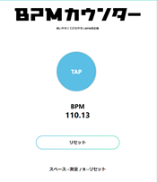

# how to program your score in Musescore

this document is for beginners creating score in computer 

@author : Yuki-kikuya
other pages : [Music Theory](./theory.md)

## 1. What's Musescore?

> **MuseScore** is the world's leading free and open-source software for writing music, with a user-friendly interface and immensely powerful features.

this software is for the person that create music scores.

* refs: [What is MuseScore? What is MuseScore.com?](https://help.musescore.com/hc/en-us/articles/210257565-What-is-MuseScore-What-is-MuseScore-com-)

## 2. let's download Musescore

first of all, you should download this software.  

access this link( [download page](https://musescore.org/en/download)[https://musescore.org/en/download) )

please select the software that adequate your OS, CPU ,etc.

## 3. start up

## 4. create new file, and initial settings

1. create new file

2. set your song attributes (title, composer, etc.)

3. choose instruments e.g. drums
   
   

4. choose key signature

   i change no items, cuz selected drumset. 

5. you set up Measures ( number of bars ) and BPM
   i recomend to set huge number you expected in Measures

you should measure BPM in this app
[BPM Counter](https://bpm.mononichi.com/)

6. set line breaks

maybe you have to set '4' measure, cuz a lot of people feel readable 

7. you complete all settings
   