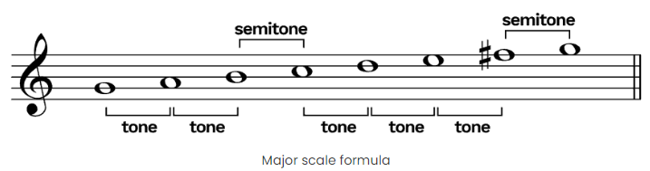
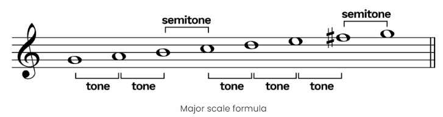
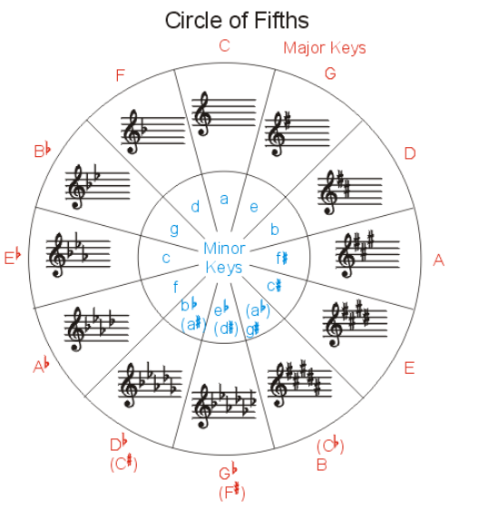
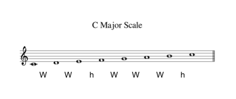
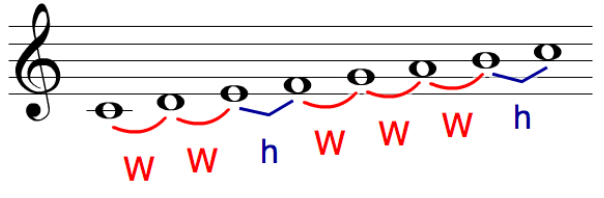

# Music Theory

## what is Scale?

a scale in music is a group of notes

### 2 types of scales
1. major scales
1. minor scales

### 2 type of tone

1. whole tone ( whole steps, 全音 )
   e.g. C → D
2. semitone ( half steps 半音 )
   e.g. C → C#

### scales
#### major scales
Tone – Tone – Semitone – Tone – Tone – Tone – Semitone

#### minor scales

Whole – Whole – Half – Whole – Whole – Whole – Half

## what is key ?

key is start point of scale

## most popular scales

C major scale

